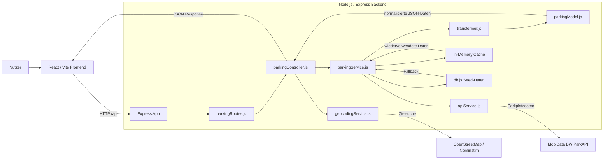
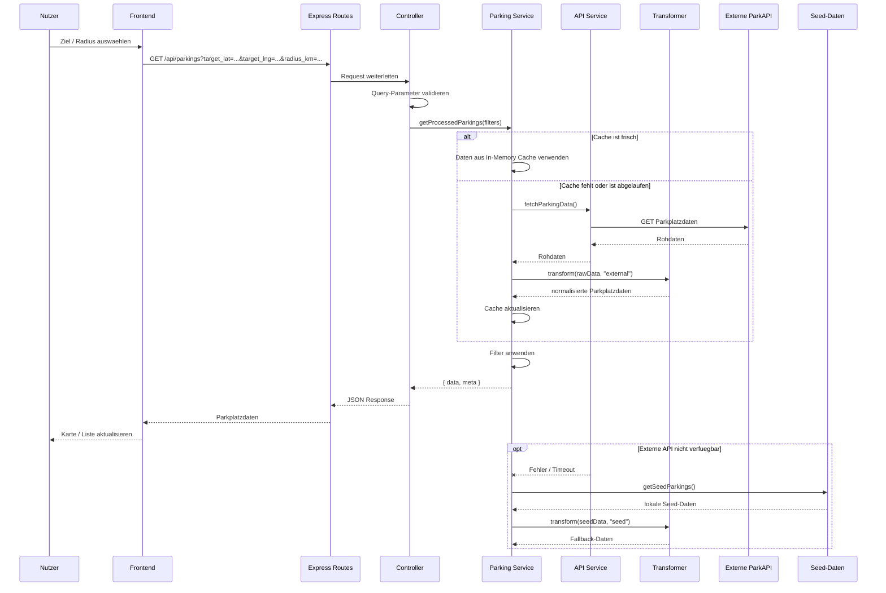
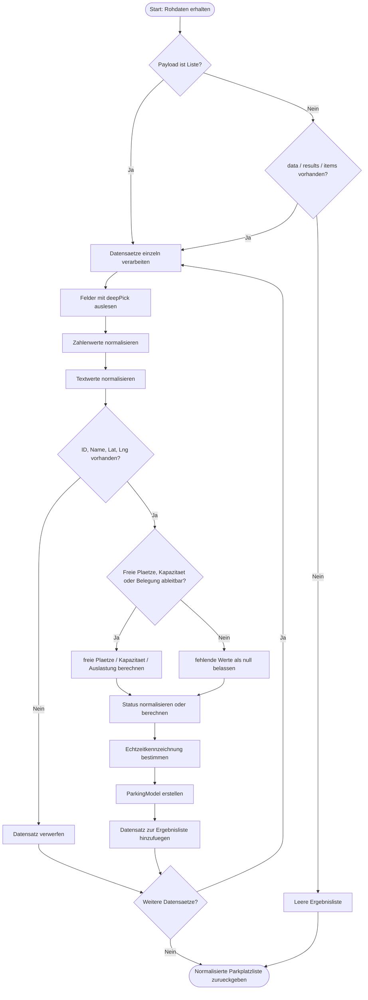

# Portfolio Phase 3

## RideAndPark - Finalisierungsphase Backend

**Studiengang:** Informatik  
**Projekt:** RideAndPark  
**Bearbeitungsbereich:** Backend  
**Bearbeiter:** Lukas Penner  
**Matrikelnummer:** 4234713  
**Betreuer:** Armands Strazds  
**Datum:** 22.05.2026

## 1. Zielsetzung, Idee und Konzept

Ziel des Projekts RideAndPark ist die Entwicklung einer Webanwendung, die freie Parkplaetze in der Naehe eines Zielortes sichtbar macht. Nutzer sollen nicht direkt mit unterschiedlichen Datenquellen arbeiten muessen, sondern ueber eine einheitliche Anwendung aktuelle Parkplatzinformationen abrufen koennen.

Der Schwerpunkt meiner Arbeit liegt auf dem Backend. Es uebernimmt die Aufgabe, externe Parkplatzdaten abzurufen, zu vereinheitlichen, zu filtern und dem Frontend ueber eine eigene REST-API bereitzustellen. Dadurch bleibt das Frontend unabhaengig von der Struktur der externen Parkplatz-API und kann mit einem stabilen internen Datenmodell arbeiten.

Das Konzept aus Phase 1 sah eine Client-Server-Architektur vor, bei der das Backend als zentrale Verarbeitungsschicht zwischen Frontend und externer Datenquelle steht. In Phase 2 wurde diese Architektur praktisch umgesetzt. In Phase 3 wurde das Backend finalisiert, stabilisiert und anhand der urspruenglichen Ziele bewertet.

Methodisch wurde ein API-first-Ansatz verfolgt. Zuerst wurden die benoetigten Schnittstellen und Datenstrukturen definiert, danach wurden die Verarbeitungsschichten im Backend aufgebaut. Die Umsetzung erfolgte iterativ und wurde ueber ein Kanban-Board organisiert.

## 2. Quellen, Ressourcen und Software

### Quellen und Ressourcen

- MobiData BW ParkAPI als externe Quelle fuer Parkplatzdaten
- OpenStreetMap / Nominatim fuer Geocoding von Zielorten
- Eigene Architekturdiagramme aus Phase 1 und Phase 2
- Eigene Projektplanung und Aufgabenverwaltung ueber ein Kanban-Board
- Projektdokumentation aus Phase 1 und Phase 2
- README- und MVP-Dokumentation des Projekts
- GitHub-Repository: https://github.com/RideAndPark/RideAndPark

### Verwendete Software und Technologien

- Node.js als Laufzeitumgebung
- Express.js fuer die REST-API
- JavaScript im CommonJS-Modulformat
- dotenv fuer Umgebungsvariablen
- cors fuer die Konfiguration erlaubter Frontend-Zugriffe
- Node Test Runner fuer automatisierte Backend-Tests
- Docker und Docker Compose fuer containerisierte Ausfuehrung
- Git und GitHub fuer Versionsverwaltung
- React/Vite im Frontend als API-Konsument

### Zentrale Backend-Dateien

- `src/app.js`: Express-App, Middleware, API-Mounting und Fehlerbehandlung
- `src/server.js`: Start des Backend-Servers
- `src/routes/parkingRoutes.js`: Definition der API-Endpunkte
- `src/controllers/parkingController.js`: Validierung von Requests und HTTP-Verarbeitung
- `src/services/parkingService.js`: Fachlogik, Caching, Filterung und Fallback
- `src/services/apiService.js`: Abruf externer Parkplatzdaten
- `src/services/geocodingService.js`: Geocoding ueber Nominatim
- `src/utils/transformer.js`: Vereinheitlichung externer Rohdaten
- `src/models/parkingModel.js`: Internes Parkplatzmodell
- `src/config/db.js`: Lokale Seed-Daten fuer den Fallback

## 3. Breakdown der Umsetzung

### 3.1 Architektur

Das Backend wurde in mehrere Schichten aufgeteilt:

- Routes definieren die verfuegbaren Endpunkte.
- Controller pruefen und validieren eingehende Parameter.
- Services enthalten die fachliche Logik.
- Der Transformer normalisiert externe Daten.
- Das Modell beschreibt die interne Parkplatzstruktur.

Diese Schichtenstruktur erhoeht die Wartbarkeit, weil Verantwortlichkeiten klar getrennt sind. Aenderungen an der externen API muessen dadurch hauptsaechlich im API-Service oder Transformer behandelt werden und wirken sich nicht direkt auf das Frontend aus.

### 3.1.1 Finales Architekturdiagramm

Das finale Architekturdiagramm zeigt die zentrale Rolle des Backends als Vermittlungs- und Verarbeitungsschicht. Das Frontend kommuniziert ausschliesslich mit der eigenen Express-API. Externe Dienste werden nur vom Backend angesprochen, wodurch Datenvalidierung, Transformation, Caching und Fehlerbehandlung kontrolliert umgesetzt werden koennen.

### 3.2 API-Endpunkte

Final bereitgestellt wurden folgende Backend-Endpunkte:

| Methode | Endpunkt | Zweck |
| --- | --- | --- |
| GET | `/api/health` | Healthcheck des Backends |
| GET | `/api/parkings` | Abruf und Filterung von Parkplaetzen |
| GET | `/api/parkings/:id` | Abruf eines einzelnen Parkplatzes |
| POST | `/api/parkings/refresh` | Manuelle Aktualisierung der Parkplatzdaten |
| GET | `/api/geocode` | Umwandlung eines Zielortes in Koordinaten |
| GET | `/api/statistics` | Rueckgabe aggregierter Parkplatzstatistiken |

Der wichtigste Endpunkt ist `/api/parkings`, da er die Grundlage fuer die Karten- und Listenansicht im Frontend bildet. Er unterstuetzt Filter nach Name, Quelle, Echtzeitdaten, offenen Parkplaetzen sowie eine Umkreissuche ueber Zielkoordinaten und Radius.

### 3.2.1 Sequenzdiagramm eines API-Requests

Beispielhaft beschreibt das folgende Sequenzdiagramm den Ablauf eines Requests an `/api/parkings`.

Der Ablauf verdeutlicht, dass ein Frontend-Request nicht direkt an die externe API weitergereicht wird. Stattdessen prueft das Backend zuerst Parameter und Cache-Zustand. Nur wenn notwendig, wird die externe Datenquelle angesprochen. Bei Fehlern kann das Backend auf lokale Seed-Daten zurueckfallen.

### 3.3 Datenverarbeitung

Externe Parkplatzdaten werden nicht unveraendert an das Frontend weitergegeben. Stattdessen uebernimmt der Transformer die Normalisierung in ein internes Datenmodell. Dieses enthaelt unter anderem:

- ID
- Name
- Koordinaten
- freie Stellplaetze
- Gesamtkapazitaet
- Auslastung
- Status
- Echtzeitkennzeichnung
- Quelle
- Aktualisierungszeitpunkt
- Oeffnungszeiten, sofern vorhanden

Die Statuswerte werden auf ein einheitliches Schema reduziert: `open`, `limited`, `full` und `unknown`. Falls die externe API keinen eindeutigen Status liefert, berechnet das Backend den Status ersatzweise aus freien Plaetzen, Kapazitaet oder Auslastung.

### 3.3.1 Ablaufdiagramm der Transformationslogik

Die Transformationslogik ist bewusst tolerant aufgebaut. Unterschiedliche Feldnamen externer Quellen werden ueber `deepPick` gesucht, Zahlenwerte werden vereinheitlicht und fehlende Informationen werden, soweit moeglich, aus vorhandenen Daten abgeleitet. Unvollstaendige Datensaetze ohne ID, Namen oder Koordinaten werden verworfen, damit das Frontend nur darstellbare Parkplaetze erhaelt.

### 3.4 Caching und Performance

Zur Reduzierung wiederholter externer API-Aufrufe wurde ein In-Memory-Cache umgesetzt. Die Cache-Dauer ist ueber `PARKING_CACHE_TTL_MS` konfigurierbar. Standardmaessig werden Daten fuer zehn Minuten wiederverwendet.

Zusaetzlich verhindert das Backend parallele Mehrfachladungen ueber eine `pendingLoad`-Logik. Wenn mehrere Requests gleichzeitig eingehen, waehrend bereits ein externer Abruf laeuft, wird derselbe Ladevorgang wiederverwendet.

Die Filterung nach Name, Quelle, Echtzeitstatus, offenen Parkplaetzen und Radius erfolgt serverseitig auf den bereits transformierten Daten. Dadurch muss das Frontend weniger Logik selbst abbilden und kann die Ergebnisse direkt darstellen.

### 3.5 Fehlerbehandlung und Fallback

Da externe Echtzeitdaten nicht immer verfuegbar oder schnell erreichbar sind, wurde ein Fallback-Mechanismus umgesetzt. Wenn die externe API ausfaellt oder keine nutzbaren Daten liefert, kann das Backend lokale Seed-Daten verwenden. Dieses Verhalten ist ueber `ALLOW_FALLBACK_DATA` steuerbar.

Fuer externe API-Aufrufe wurden Timeouts und ein Retry nach Timeout integriert. Fehler werden ueber die zentrale Express-Fehlerbehandlung als JSON-Antworten ausgegeben. Ungueltige Query-Parameter, zum Beispiel fehlerhafte Zahlenwerte oder ungueltige Boolean-Werte, werden mit HTTP 400 beantwortet.

### 3.6 Tests

Fuer zentrale Backend-Funktionen wurden automatisierte Tests mit dem Node Test Runner umgesetzt. Getestet werden unter anderem:

- Aufbau externer API-URLs
- Retry-Verhalten bei Timeouts
- Fehler bei nicht erfolgreichen HTTP-Antworten
- Transformation und Caching von Parkplatzdaten
- Fallback auf Seed-Daten
- Radiusfilter
- Abruf einzelner Parkplaetze
- Serverstart mit konfiguriertem oder standardmaessigem Port

Dadurch ist die wichtigste Backend-Logik nachvollziehbar abgesichert.

## 4. Ergebnis von der Konzeptidee bis zur Umsetzung

Die urspruengliche Konzeptidee aus Phase 1 war ein Backend, das externe Parkplatzdaten integriert, verarbeitet und ueber eine REST-API fuer das Frontend bereitstellt. Dieses Ziel wurde erreicht.

Das finale Backend bietet eine funktionsfaehige API fuer Parkplaetze, Einzelabfragen, Aktualisierung, Geocoding, Healthcheck und Statistikdaten. Externe Daten werden in ein einheitliches internes Format ueberfuehrt und koennen vom Frontend unabhaengig von der externen API-Struktur genutzt werden.

Die in Phase 2 beschriebenen Schwerpunkte wurden weitgehend umgesetzt:

- Die Schichtenarchitektur ist realisiert.
- Die externe Parkplatz-API ist angebunden.
- Die Transformationslogik ist implementiert.
- Geocoding ist vorhanden.
- Caching ist umgesetzt.
- Fallback-Daten erhoehen die Stabilitaet.
- Query-Parameter werden validiert.
- Erste Tests sichern zentrale Backend-Funktionen ab.

Das Ergebnis entspricht damit dem Ziel der Arbeit. Eine vollstaendige produktive Infrastruktur mit persistenter Datenbank, Redis-Cache oder umfangreichem Monitoring wurde nicht umgesetzt. Diese Punkte waren in Phase 1 als moegliche Erweiterungen beschrieben, fuer das MVP aber nicht zwingend erforderlich. Statt einer Datenbank wurde fuer die aktuelle Projektstufe bewusst ein In-Memory-Cache mit Fallback-Daten eingesetzt. Das ist fuer ein MVP ausreichend, waere fuer einen produktiven Mehrinstanzbetrieb aber zu erweitern.

## 5. Zielerreichung

Das Backend erfuellt die zentralen Anforderungen des Projekts:

- Parkplaetze koennen ueber eine eigene API abgerufen werden.
- Externe Rohdaten werden normalisiert.
- Das Frontend muss die externe API nicht direkt kennen.
- Zielkoordinaten und Radiusfilter koennen verarbeitet werden.
- Echtzeitdaten und Statuswerte werden vereinheitlicht.
- Bei Fehlern der externen Quelle bleibt die Anwendung ueber Seed-Daten grundsaetzlich nutzbar.
- Die Anwendung ist lokal und per Docker lauffaehig.

Die wichtigste Zielabweichung betrifft die urspruenglich angedachte Datenbank. In der finalen Umsetzung wird keine persistente Datenbank verwendet. Der Grund dafuer ist die Fokussierung auf ein MVP: Fuer die benoetigte Live-Abfrage und kurzfristige Zwischenspeicherung reicht der In-Memory-Cache aus. Eine Datenbank wuerde vor allem fuer historische Analysen, langfristige Speicherung oder produktive Skalierung relevant werden.

Auch die Performanceanalyse wurde nur teilweise umgesetzt. Es gibt bereits Caching, Timeouts und reduzierte externe Abrufe, aber noch kein systematisches Monitoring mit Messwerten. Fuer die Zielsetzung der Projektarbeit reicht die erreichte Stabilisierung aus, fuer einen produktiven Betrieb waeren weitere Messungen notwendig.

## 6. Reflexion der Leistung

Der Bearbeitungsprozess zeigt, dass die Trennung zwischen Frontend, Backend und externer Datenquelle eine sinnvolle Entscheidung war. Besonders bei heterogenen Echtzeitdaten ist es wichtig, eine eigene kontrollierte Verarbeitungsschicht zu besitzen. Dadurch koennen Validierung, Fehlerbehandlung und Normalisierung zentral umgesetzt werden.

Eine wichtige Erkenntnis ist, dass externe APIs in der Praxis nicht nur technisch angebunden werden muessen. Entscheidend sind auch Datenqualitaet, Antwortzeiten, uneinheitliche Feldnamen und Ausfallverhalten. Der Transformer wurde deshalb wichtiger als zu Beginn erwartet, weil er die Grundlage fuer ein stabiles internes Modell bildet.

Rueckblickend haette eine fruehere systematische Performanceanalyse geholfen, Engpaesse praeziser zu bewerten. In Phase 2 wurde bereits erkannt, dass die Transformation und externe API-Aufrufe potenzielle Schwachstellen sind. In Phase 3 konnten diese Risiken durch Caching, Timeout-Verhalten und Fallback reduziert werden, aber nicht vollstaendig durch Messwerte belegt werden.

Positiv ist, dass das Backend modular aufgebaut ist. Neue Datenquellen, weitere Filter oder eine spaetere Datenbankanbindung koennen ergaenzt werden, ohne die gesamte Anwendung neu strukturieren zu muessen. Die Tests machen zentrale Funktionen reproduzierbar pruefbar und erleichtern spaetere Erweiterungen.

## 7. Fazit

Die Finalisierungsphase zeigt, dass aus der Konzeptidee ein funktionsfaehiges Backend fuer RideAndPark entstanden ist. Die Anwendung verfuegt ueber eine eigene REST-API, eine klare Schichtenarchitektur, externe Datenanbindung, Transformation, Caching, Geocoding, Fallback-Mechanismen und automatisierte Tests.

Das Backend erreicht damit das Ziel der Arbeit fuer den MVP-Umfang. Es stellt dem Frontend eine stabile Grundlage bereit, um Parkplaetze in der Naehe eines Zielortes anzuzeigen und nach relevanten Kriterien zu filtern.

Fuer eine Weiterentwicklung waeren vor allem folgende Punkte sinnvoll:

- persistente Speicherung in einer Datenbank
- Redis oder ein vergleichbarer verteilter Cache
- systematisches Monitoring und Laufzeitmessungen
- erweiterte Tests mit realen API-Payloads
- robustere Behandlung weiterer externer Datenformate
- produktionsnahe Deployment- und Sicherheitskonfiguration

Insgesamt konnte das Backend von der Konzeption ueber die Erarbeitung bis zur Finalisierung erfolgreich umgesetzt werden. Die urspruengliche Zielsetzung wurde erreicht, wobei einige bewusst ausgeklammerte Produktivfunktionen als naechste Entwicklungsschritte bestehen bleiben.
